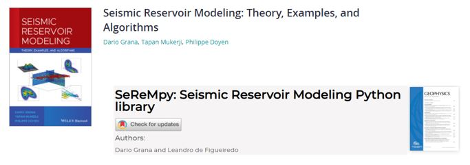
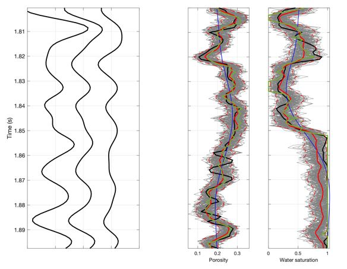

# SeReMpy

### Seismic Reservoir Modeling Python package ###

Python open source library for Seismic Reservoir Modeling. This library is related to the following publications: 

- Dario Grana, Tapan Mukerji and Philippe Doyen, (2021), Seismic Reservoir Modeling: Theory, Examples, and Algorithms, Wiley.

-  Dario Grana and Leandro de Figueiredo, (2021), "SeReMpy: Seismic reservoir modeling Python library, GEOPHYSICS 86: F61-F69.

### Guide ###

Several examples and applications can be found within the folders ''Examples'', 'Applications' and 'Additional examples'. Any doubt, send us an e-mail at leandrop.fgr (at) gmail.com

The library is organized within the SeReMpy folder as follow:

- *Data:* this folder contains six datasets used for the examples and the elevation dataset from Yellowstone National Park;
- *RockPhysics:* this library contains functions with several rock physics models;
- *Geostats:* this library contains functions for kriging and geostatistical simulations of random variables;
- *Inversion:* this library contains functions for seismic and rock physics inversion using the analytical and numerical solutions;
- *Facies:* this library contains functions for facies classification and simulation. The SeReMpy package includes multiple scripts with several examples.

